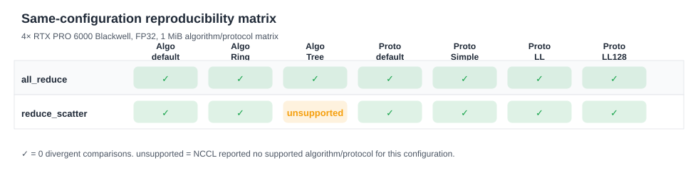
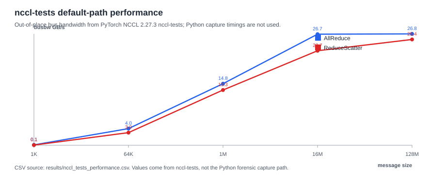
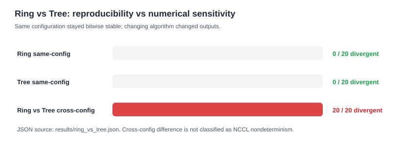

# Tencent HPN ISSUE4 Experiment Report

Date: 2026-08-09 UTC
Target checkout: `Tencent/hpn` commit `fcb16fe5a2942da749543b0e206707c7f3faba54`

## Executive Summary

On the measured 4× NVIDIA RTX PRO 6000 Blackwell Server Edition PCIe system, no same-configuration independent run-to-run bitwise divergence was observed for NCCL AllReduce or ReduceScatter across the retained matrix.  A controlled 1-ULP perturbation was localized exactly by the detector.  Ring and Tree AllReduce were each same-configuration reproducible, while Ring-vs-Tree outputs differed for identical inputs; this is cross-configuration numerical sensitivity, not same-configuration nondeterminism.

The findings are limited to the recorded single-node Blackwell PCIe topology and software stack.

## Environment

Canonical file: `results/environment_summary.json`

| Item | Value |
|---|---|
| GPU | 4× NVIDIA RTX PRO 6000 Blackwell Server Edition |
| GPU compute capability | 12.0 |
| Topology | PCIe/NUMA; no NVLink/NVSwitch detected |
| Driver | 580.76.05 |
| CUDA toolkit | `/usr/local/cuda-12.8/bin/nvcc` 12.8.93 |
| Python | `/root/miniconda3/bin/python3` 3.12.3 |
| PyTorch | 2.8.0+cu128 |
| PyTorch CUDA | 12.8 |
| PyTorch NCCL runtime | 2.27.3 |
| System NCCL packages | 2.25.1-1+cuda12.8 |

Topology notes from `nvidia-smi topo -m` and runtime audit:

- GPU0/GPU1/GPU2 are `NODE` connected; GPU3 is `SYS` relative to GPU0/GPU1/GPU2.
- GPU P2P read/write checks reported `OK` for all cross-GPU pairs.
- `torch.cuda.can_device_access_peer` returned `True` for all cross-GPU pairs.
- NCCL reported `0 nvls channels` and `NVLS multicast support is not available`.

## Methodology

Same-configuration reproducibility is tested with process lifecycle isolation:

1. `diagnose.py` starts one experiment directory.
2. Each independent run launches a fresh `python -m torch.distributed.run` subprocess.
3. `worker.py` initializes a new NCCL process group / communicator.
4. Workers generate deterministic rank-distinct tensors for each collective call.
5. Workers execute the fixed collective sequence and write raw output bytes.
6. The worker processes exit completely.
7. The orchestrator compares run 0 against later independent runs at raw-byte level.

Default baselines sanitize common NCCL override variables before worker launch: `NCCL_ALGO`, `NCCL_PROTO`, `NCCL_P2P_DISABLE`, and `NCCL_NVLS_ENABLE`.  Algorithm and protocol overrides are set only for explicit matrix cases.

The comparator does not use tolerance checks.  It reports exact byte equality, changed element / byte / bit counts, first differing element / byte / bit, max absolute error, max relative error, and ULP distance.

## Reviewer Figures

The figures below are generated by `make_figures.py` from committed CSV/JSON evidence.







Regenerate them with:

```bash
python3 -m issue4.make_figures
```

## Same-Configuration Results

Canonical files:

- `results/same_config_matrix.csv`
- `results/algorithm_protocol_matrix.csv`
- `results/size_sweep.csv`

Algorithm/protocol matrix at 1 MiB, FP32, 5 independent launches, 10 calls per launch, 4 ranks:

| Collective | Default algorithm | Ring | Tree | Default proto | Simple | LL | LL128 |
|---|---|---|---|---|---|---|---|
| AllReduce | pass | pass | pass | pass | pass | pass | pass |
| ReduceScatter | pass | pass | unsupported | pass | pass | pass | pass |

`pass` means zero divergent same-configuration comparisons.  `unsupported` means NCCL returned no available algorithm/protocol for that forced configuration.

Default message-size sweep, FP32, 5 independent launches, 3 calls per launch, 4 ranks:

| Collective | Sizes | Comparisons per size | Divergent comparisons |
|---|---|---:|---:|
| AllReduce | 1 KiB, 64 KiB, 1 MiB, 16 MiB, 128 MiB | 48 | 0 |
| ReduceScatter | 1 KiB, 64 KiB, 1 MiB, 16 MiB, 128 MiB | 48 | 0 |

Interpretation: in this measured range, same-configuration independent launches were bitwise identical.  This does not establish a general determinism guarantee for NCCL.

## Controlled Injection

Canonical file: `results/controlled_injection.json`

The injection case changes run 1 / call 1 / rank 0 / element 5 by 1 ULP.  The comparator reported:

| Field | Value |
|---|---:|
| Divergent comparisons | 1 / 3 |
| First differing element | 5 |
| First differing byte | 20 |
| First differing bit | 160 |
| Changed elements | 1 |
| Changed bytes | 1 |
| Changed bits | 4 |
| Max ordered ULP | 1 |

Interpretation: the detector can localize a 1-ULP difference.  This is detector validation only and is not evidence of NCCL nondeterminism.

## Ring vs Tree Cross-Configuration Case

Canonical file: `results/ring_vs_tree.json`

| Case | Divergent comparisons | Interpretation |
|---|---:|---|
| Ring same-configuration | 0 / 20 | Ring path was stable across independent launches |
| Tree same-configuration | 0 / 20 | Tree path was stable across independent launches |
| Ring vs Tree cross-configuration | 20 / 20 | Changing reduction path changed output bits |

First cross-configuration difference:

| Field | Value |
|---|---:|
| Rank | 0 |
| Call | 0 |
| Element | 0 |
| Changed elements in first differing tensor | 40615 |
| Max absolute error | 4.0 |
| Max relative error | 0.0008580020492087777 |
| Max ordered ULP | 7416 |

Interpretation: Ring-vs-Tree differences are cross-configuration numerical sensitivity caused by a changed reduction path.  They are not same-configuration nondeterminism.

## NCCL Algorithm / Protocol Evidence

Canonical file: `results/nccl_trace_selection_summary.json`

Observed NCCL TRACE/TUNING selections:

| Case | NCCL selection |
|---|---|
| Default AllReduce 1 MiB | `Algo RING proto SIMPLE` |
| Default ReduceScatter 1 MiB | `Algo RING proto SIMPLE` |
| Forced Tree + LL128 AllReduce 1 MiB | `Algo TREE proto LL128` |

ReduceScatter with `NCCL_ALGO=Tree` is recorded as unsupported on this stack.  The error class is retained in `results/algorithm_protocol_matrix.csv` and the compatibility note is indexed in `results/RESULTS_INDEX.md`.

## Blackwell NCCL Compatibility Finding

Canonical file: `results/nccl_tests_compatibility_summary.json`

| Build | NCCL version | Result |
|---|---:|---|
| `nccl-tests` linked against system NCCL | 2.25.1 | failed on Blackwell with `unhandled cuda error` |
| same `nccl-tests` checkout linked against PyTorch wheel NCCL | 2.27.3 | succeeded and produced performance CSVs |

The report does not infer an unverified root cause.  It records the observed failure/success split and the exact linked NCCL versions.

## Performance Evidence

Canonical file: `results/nccl_tests_performance.csv`

Performance data comes from `nccl-tests` linked against PyTorch wheel NCCL 2.27.3.  Python diagnostic capture timing is not used as NCCL kernel performance data.

Selected out-of-place default-path rows:

| Collective | Size | Time (us) | algbw (GB/s) | busbw (GB/s) |
|---|---:|---:|---:|---:|
| AllReduce | 1 KiB | 16.26 | 0.06 | 0.09 |
| AllReduce | 64 KiB | 24.52 | 2.67 | 4.01 |
| AllReduce | 1 MiB | 106.22 | 9.87 | 14.81 |
| AllReduce | 16 MiB | 942.36 | 17.80 | 26.71 |
| AllReduce | 128 MiB | 7518.38 | 17.85 | 26.78 |
| ReduceScatter | 1 KiB | 15.55 | 0.07 | 0.05 |
| ReduceScatter | 64 KiB | 16.16 | 4.06 | 3.04 |
| ReduceScatter | 1 MiB | 59.22 | 17.71 | 13.28 |
| ReduceScatter | 16 MiB | 553.51 | 30.31 | 22.73 |
| ReduceScatter | 128 MiB | 3956.27 | 33.93 | 25.44 |

## Acceptance Mapping

| ISSUE4 requirement | Implementation | Real-hardware evidence | File |
|---|---|---|---|
| Fresh independent runs | `diagnose.py` launches fresh `torchrun` per run; `worker.py` creates a new NCCL process group | same-config matrix has independent launches with zero divergences | `results/algorithm_protocol_matrix.csv` |
| Deterministic rank-distinct input | `data_generator.py` maps seed/rank/call/element/dtype to bytes | input hash consistency recorded in canonical evidence | `results/size_sweep.csv` |
| Raw bitwise comparison | `comparator.py` compares bytes and reports first element/byte/bit and ULP | 1-ULP injection localized exactly | `results/controlled_injection.json` |
| AllReduce coverage | `worker.py` supports `torch.distributed.all_reduce` | default, Ring, Tree, protocol, and size cases | `results/algorithm_protocol_matrix.csv`, `results/size_sweep.csv` |
| ReduceScatter coverage | `worker.py` supports `torch.distributed.reduce_scatter_tensor` | default, Ring, protocol, and size cases; Tree unsupported | `results/algorithm_protocol_matrix.csv` |
| Message-size sweep | `sweep.py` runs 1 KiB through 128 MiB | 0 divergent comparisons for both collectives | `results/size_sweep.csv` |
| Algorithm/protocol sweep | `sweep.py` sets `NCCL_ALGO` / `NCCL_PROTO` only for explicit cases | AllReduce Tree/Ring/default and protocol matrix recorded | `results/algorithm_protocol_matrix.csv` |
| Controlled detector validation | `reproduce_case.py injection` | run/call/rank/element localized; max ordered ULP = 1 | `results/controlled_injection.json` |
| Cross-algorithm distinction | `reproduce_case.py cross-algo` and `compare_experiments.py` | Ring same-config 0/20, Tree same-config 0/20, Ring-vs-Tree 20/20 different | `results/ring_vs_tree.json` |
| NCCL path evidence | `NCCL_DEBUG=INFO`, `NCCL_DEBUG_SUBSYS=INIT,GRAPH,COLL/TUNING` | default path selected Ring/Simple; forced Tree/LL128 selected as requested | `results/nccl_trace_selection_summary.json` |
| Blackwell compatibility audit | `nccl-tests` built against two NCCL runtimes | system NCCL 2.25.1 failed; PyTorch NCCL 2.27.3 succeeded | `results/nccl_tests_compatibility_summary.json` |
| Performance baseline | `nccl-tests` with PyTorch wheel NCCL 2.27.3 | latency/algbw/busbw retained as CSV | `results/nccl_tests_performance.csv` |
| CPU tests | dependency-free runner | 12/12 passed | `run_cpu_tests.py`, `tests/` |

## Reproduction Commands

Run from `hpn/src/code`.

CPU tests:

```bash
python3 -m issue4.run_cpu_tests
```

Default 4-GPU AllReduce:

```bash
python3 -m issue4.diagnose \
  --collective all_reduce \
  --dtype float32 \
  --size-bytes 1MiB \
  --runs 5 \
  --calls 20 \
  --nproc-per-node 4
```

Default 4-GPU ReduceScatter:

```bash
python3 -m issue4.diagnose \
  --collective reduce_scatter \
  --dtype float32 \
  --size-bytes 1MiB \
  --runs 5 \
  --calls 20 \
  --nproc-per-node 4
```

Controlled injection:

```bash
python3 -m issue4.reproduce_case injection \
  --collective all_reduce \
  --dtype float32 \
  --size-bytes 1KiB \
  --calls 3 \
  --nproc-per-node 1 \
  --inject-call 1 \
  --inject-rank 0 \
  --inject-element 5 \
  --inject-ulp 1
```

Ring-vs-Tree case:

```bash
python3 -m issue4.reproduce_case cross-algo \
  --collective all_reduce \
  --dtype float32 \
  --size-bytes 1MiB \
  --runs 2 \
  --calls 5 \
  --nproc-per-node 4
```

Regenerate figures from canonical evidence:

```bash
python3 -m issue4.make_figures
```

## Limitations

- Single node only.
- 4 GPUs only.
- PCIe/NUMA topology only; no NVLink/NVSwitch experiment.
- No multi-node RDMA experiment.
- Main full GPU forensic dtype is FP32.
- Same-configuration negative results apply only to the recorded hardware, topology, rank mapping, software stack, NCCL settings, message sizes, and call counts.
